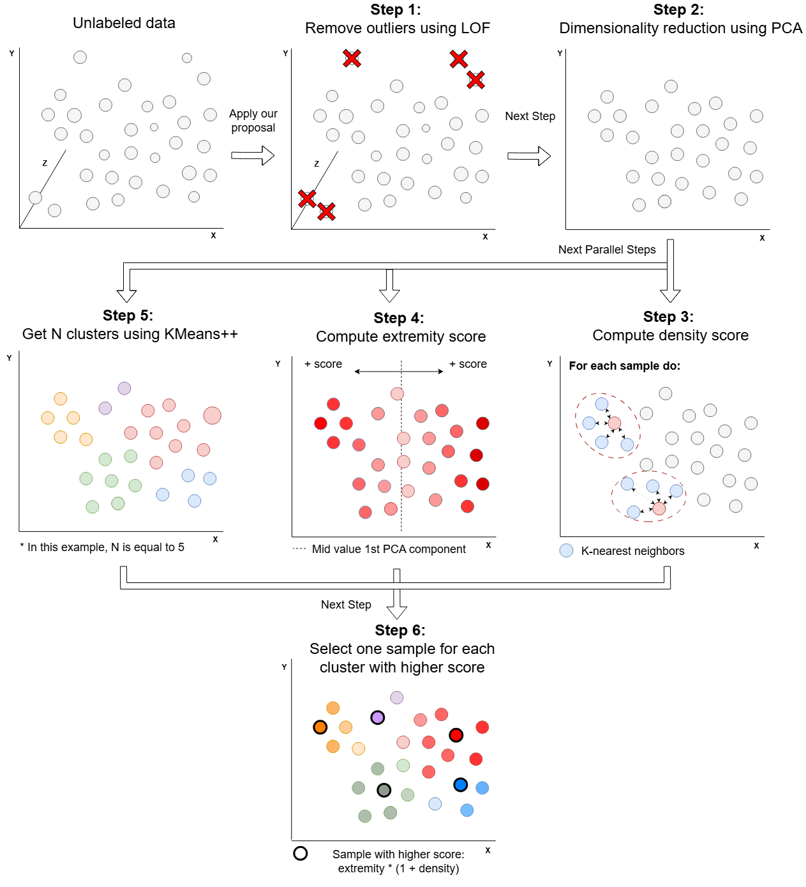

# EDRS: Extremity-Density Representative Selection for Semi-Supervised Learning

[](https://creativecommons.org/licenses/by/4.0/)
[](https://doi.org/10.1016/j.ins.2026.123390)

EDRS (Extremity-Density Representative Selection) is a novel unsupervised sample selection algorithm designed to construct representative, balanced labeled sets from highly imbalanced unlabeled tabular data in Semi-Supervised Learning (SSL) settings. 

---

## 📖 Method Overview

The EDRS pipeline consists of six distinct stages designed to balance local structural representativeness (density) with the exploration of class boundaries (extremity) while filtering out noisy anomalies:

<p align="center">
  
</p>

### The Six Algorithmic Stages

#### 1. Outlier Removal
To prevent the propagation of noisy anomalies as representative points, we filter out instances with high **Local Outlier Factor (LOF)** scores:

$$\text{reach-dist}_k(x_1, x_2) = \max\{\text{k-dist}(x_2),\, d(x_1, x_2)\}$$

$$\text{lrd}_k(x_1) = \frac{|N_k(x_1)|}{\sum_{x_2 \in N_k(x_1)} \text{reach-dist}_k(x_1, x_2)}$$

$$\text{LOF}_k(x_1) = \frac{1}{|N_k(x_1)|} \cdot \sum_{x_2 \in N_k(x_1)} \frac{\text{lrd}_k(x_2)}{\text{lrd}_k(x_1)}$$

#### 2. Dimensionality Reduction
Data is projected onto the first two components using **Principal Component Analysis (PCA)** to preserve global Euclidean distances:

$$X_{\text{pca}} = X[\mathbf{v}_1, \mathbf{v}_2]$$

#### 3. Compute Density Score
The density score $d_i$ evaluates local representativeness using the inverse of the median Euclidean distance to its $k'$ nearest neighbors in PCA space:

$$d_i = \left( \text{median}_{\mathbf{x}_j \in N_{k'}(\mathbf{x}_i)} \|\mathbf{x}_i - \mathbf{x}_j\|_2 \right)^{-1}$$

Densities below a user-defined threshold quantile $\delta_{\text{density}}$ are zeroed out to avoid low-density boundary noise.

#### 4. Compute Extremity Score
For binary classification tasks, the first principal component represents the axis of maximum variance. Extremity $e_i$ is computed by normalizing the first PC projection ($p_{i,1}$) to $[0,1]$ and calculating the distance to the midpoint:
$$p'_{i,1} = \frac{p_{i,1} - \min(p_{\cdot,1})}{\max(p_{\cdot,1}) - \min(p_{\cdot,1})}$$
$$e_i = 2 \cdot |p'_{i,1} - 0.5|$$

#### 5. Cluster into $N$ Groups
To ensure spatial diversity across the feature space, the PCA space is partitioned into $N$ clusters (matching the labeling budget) using **K-Means++**.

#### 6. Representative Selection & Extremity Swap
A composite score balances density and extremity:
$$s_i = d_i \cdot (1 + e_i)$$
Inside each cluster, the instance with the highest $s_i$ is initially selected. If its extremity score falls below a threshold $e_{\text{thresh}}$, it is swapped for the most extreme instance in the same cluster to guarantee sufficient minority class coverage.

---

## 📊 Experimental Results

We evaluate EDRS against 10 baseline selection methods across multiple Semi-Supervised downstream algorithms (Contrastive Mixup, Manifold Mixup, VIME, and Autoencoders).

### 1. Synthetic Imbalanced Datasets (weighted average F1-score)
Evaluation on synthetic datasets with a 90-10 class imbalance and different Fisher Discriminant Ratios (FDR):

| Method (Budget = 500) | FDR = 4.0 (800 pts) | FDR = 4.0 (50k pts) | FDR = 1.0 (800 pts) | FDR = 1.0 (50k pts) | FDR = 0.125 (800 pts) | FDR = 0.125 (50k pts) |
|---|---|---|---|---|---|---|
| Random | 0.5834 | 0.6627 | 0.4611 | 0.4976 | 0.2427 | 0.3155 |
| Stratified | 0.6033 | 0.6487 | 0.3689 | 0.5188 | 0.2054 | 0.3255 |
| K-Means | 0.6599 | 0.4277 | 0.3298 | 0.2499 | 0.2699 | 0.2098 |
| K-Means++ | 0.8099 | 0.1288 | 0.5699 | 0.3699 | 0.3877 | 0.2677 |
| USL | 0.5999 | 0.2477 | 0.5999 | 0.4399 | **0.4677** | **0.3377** |
| FDMat | 0.6550 | 0.4820 | 0.4850 | 0.4380 | 0.3357 | 0.2520 |
| Hybrid-CEAL | 0.7252 | 0.5720 | 0.5720 | 0.4250 | 0.3952 | 0.2854 |
| ESC-FFS | 0.4899 | 0.4377 | 0.3899 | 0.3471 | 0.2677 | 0.2264 |
| Gaussian Mapping | 0.7750 | 0.6150 | 0.5932 | 0.4352 | 0.4352 | 0.3023 |
| **EDRS (Ours)** | **0.7899** | **0.6377** | **0.6099** | **0.4471** | 0.4477 | 0.3077 |

### 2. Real-World Datasets (weighted average F1-score)
Downstream performance comparison using Contrastive Mixup across public benchmarks and our in-house smart village dataset (**Smart Poqueira**):

| Method (Budget = 500) | Smart Poqueira (FDR=3.59) | Breast Cancer (FDR=1.89) | Thyroid (FDR=0.45) | Wilt (FDR=0.19) | Seismic (FDR=0.10) | Bank (FDR=0.02) |
|---|---|---|---|---|---|---|
| Random | 0.9854 | 0.8060 | 0.5150 | 0.8350 | 0.7350 | 0.7800 |
| Stratified | 0.9872 | 0.8140 | 0.5320 | 0.7400 | 0.7050 | **0.7900** |
| K-Means | 0.9884 | 0.8120 | 0.5500 | 0.8100 | 0.7850 | 0.5400 |
| K-Means++ | 0.9892 | 0.8180 | 0.5450 | 0.8400 | 0.8550 | 0.5750 |
| Bisecting K-Means++ | 0.9893 | 0.8150 | 0.5100 | 0.8750 | **0.8550** | 0.4100 |
| USL | 0.9894 | 0.8200 | **0.5612** | 0.8700 | 0.8400 | 0.6350 |
| FDMat | 0.9887 | 0.8164 | 0.5280 | 0.8380 | 0.8102 | 0.7851 |
| Hybrid-CEAL | 0.9895 | 0.8480 | 0.5522 | 0.8615 | 0.8353 | 0.6008 |
| ESC-FFS | 0.9888 | **0.8850** | 0.5400 | 0.8050 | 0.7600 | 0.3400 |
| Gaussian Mapping | 0.9897 | 0.8553 | 0.5581 | **0.8756** | 0.8505 | 0.6006 |
| **EDRS (Ours)** | **0.9899** | 0.8600 | **0.5612** | 0.8700 | 0.8450 | 0.5450 |

---

## 🛠️ Project Structure

```
├── configs/
│   └── config.yaml          # Configurable hyperparameters (LOF, density, e_thresh)
├── src/
│   ├── edrs.py              # Core EDRS algorithm (Stages 1-6)
│   ├── ssl_pipeline.py      # Semi-supervised training pipeline
│   ├── data_loader.py       # OpenML dataset registry loader
│   ├── ablation.py          # Script evaluating contribution of density and extremity
│   ├── sensitivity.py       # Parameter sweeping for e_thresh and LOF contamination
│   └── utils.py             # Utility functions
├── images/
│   ├── proposal.png         # General EDRS flowchart
│   ├── pipeline.png         # Pipeline flowchart
│   └── smart_villages.png   # Smart Poqueira deployment overview
└── requirements.txt         # Project dependencies
```

---

## 🚀 Getting Started

### Installation
Clone the repository and install dependencies:
```bash
pip install -r requirements.txt
```

### Reproduce Ablation Study
```bash
PYTHONPATH=. python -m src.ablation --folder ablation_results
```

### Reproduce Sensitivity Analysis
```bash
PYTHONPATH=. python -m src.sensitivity --folder sensitivity_results
```

### Run SSL Pipeline
```bash
# Evaluate on bank marketing
PYTHONPATH=. python -m src.ssl_pipeline --config configs/config.yaml --dataset bank
```

---

## 📝 Citation

If you use this code in your research, please cite:

```bibtex
@article{duran2026edrs,
  title={EDRS: Extremity-density representative selection for semi-supervised learning on imbalanced data},
  author={Dur{\'a}n-L{\'o}pez, Alberto and Bola{\~n}os-Martinez, Daniel and Bermudez-Edo, Maria},
  journal={Information Sciences},
  volume={690},
  pages={123390},
  year={2026},
  publisher={Elsevier},
  doi={https://doi.org/10.1016/j.ins.2026.123390}
}
```

---

## 📄 License

This repository is licensed under the Creative Commons Attribution 4.0 International License (CC BY 4.0) © SmartPoqueira.
